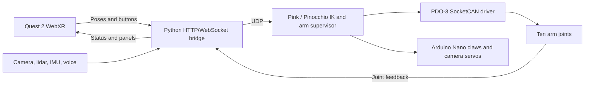

# Berkeley Humanoid Lite · Quest VR Teleoperation

**A Quest 2 browser interface for simulated and physical humanoid arms.**

I built a WebXR-to-robot control path around Berkeley Humanoid Lite: controller poses, inverse kinematics, SocketCAN actuation, per-joint power calibration, live tuning, and robot feedback inside the headset. The system runs beside the robot on a Linux Intel N150 PC.

[Portfolio and hardware demo](https://jose-sanchez-portfolio-com.vercel.app/projects/berkeley-humanoid-vr/) · [Operator guide](docs/VR_TELEOP.md) · [As-built notes](arm_validation/TELEOP_AND_ARM_BRINGUP.md)

[](https://jose-sanchez-portfolio-com.vercel.app/media/humanoid-vr/quest-vr-teleop.mp4)

*10-second preview from the October 1 recording: developer panels (4 s), model-to-calibration settings and a labeled overview of separate recording frames (4 s), then physical arm control (2 s). Click for the video. Qualitative hardware evidence, not a tracking benchmark or learned locomotion-policy transfer result.*

## Problem, solution, contribution

Upstream teleoperation uses SteamVR and Vive controllers. I replaced that input path with Meta Quest 2 controller tracking in the Quest Browser and added calibration, diagnostics, and feedback for this robot's actual arm wiring.

The same headset flow can drive an offline joint model or the physical arms. The simulator models joint-side PD control, gravity, friction, torque limits, and end stops; it supports rehearsal and software tests, not proof of full-body policy transfer.

## Architecture



- `scripts/teleop/quest_bridge.html` and `quest_bridge.py`: WebXR input, transports, headset panels, and status relay.
- `run_teleop.py`: inverse kinematics, motion gating, calibration, and tuning.
- `arm_driver.py` and `arm_power.py`: hardware/offline drivers, batched CAN replies, gravity feedforward, and torque limits.
- `arm_validation/`: calibration reports, encoder audits, closed-loop probes, and session logs.

## Evidence and limits

- **Physical arm bring-up:** the as-built notebook records controller tracking, UDP packets, arming, and joint movement. Ten joints are mapped across two 1-Mbps arm buses; the right wrist answers as ID 12 on this unit. [Lab notes](arm_validation/TELEOP_AND_ARM_BRINGUP.md)
- **Ten-joint calibration:** the September 24 report records an `OK` verdict for each arm joint, with joint-specific torque ceilings and gravity fits. These are calibration results, not a general manipulation-success rate. [Report](arm_validation/calibration_20260924_1111.md)
- **Closed-loop check:** one left-wrist session passes ±10° steps and returns, reaching 90% of each command in 0.23–0.25 s. This is one joint and one test condition. [Report](arm_validation/closed_loop/20260924_110748_can0_id9/report.txt)

The headset includes stereo camera views, lidar/IMU panels, and per-eye Depth Anything V2 relative depth plus RAFT optical flow. Relative depth is rescaled per image; it is not calibrated metric stereo depth. The CPU vision grid refreshes slowly and does not close the arm-control loop.

## Engineering decisions and tradeoffs

- Batch PDO-3 position/feedforward messages and collect replies against a shared deadline, replacing serial per-joint waits that timed out over USB CAN.
- Start in damping; require explicit arming and held grip for motion. Reject estimated controller poses and guard arm-bus USB identities.
- Fit per-joint gravity compensation and constrain power to calibrated limits. Live tuning has persistent profiles and undo.
- Keep voice, camera, screen share, and control in separate processes. Heavy vision work runs only while requested.

This remains a lab prototype. Tracking depends on headset visibility, CAN timing can vary, and a software arm/stop gesture is not a physical emergency stop. Legs and walking-policy deployment are outside this teleoperation path.

## Setup and checks

Use Linux, Python 3.10, the upstream robot assets/low-level dependencies, and the packages in `pyproject.toml`. The submodules use SSH URLs; GitHub SSH access is required unless those URLs are changed to HTTPS. Vision and voice helpers need additional models and system services documented in the [operator guide](docs/VR_TELEOP.md).

```bash
git clone --recurse-submodules https://github.com/joses2017smjh/quest-vr-teleop.git
cd quest-vr-teleop
# After preparing the documented .venv and optional helper dependencies:
./scripts/teleop/bringup.py --sim
./scripts/teleop/bringup.py status
```

Open the printed headset URL and configure the documented secure-origin/USB-localhost path for WebXR. For hardware bring-up, verify this unit's bus map and calibration first, start with the arms hanging at zero, then use `./scripts/teleop/bringup.py`.

```bash
.venv/bin/python tools/test_teleop_tuning.py
.venv/bin/python tools/test_voice_typer.py
.venv/bin/python tools/test_claude_sessions.py
# Separate QuickJS environment; no robot or headset required:
python tools/test_quest_page.py
```

The tuning check uses simulated arms and a scratch profile. Voice/session checks require tmux; the page check requires QuickJS and the robot-model assets for its full geometry checks. These tests do not measure physical manipulation performance.

**Stack:** Python, JavaScript/WebXR, Pink, Pinocchio, QP IK, SocketCAN, Arduino, OpenCV, ONNX Runtime, PyTorch, Vosk, Whisper, Piper, tmux.

## Upstream attribution and license

This is my teleoperation fork of [Berkeley Humanoid Lite](https://github.com/HybridRobotics/Berkeley-Humanoid-Lite), not the original robot design. Upstream robot documentation is [here](https://berkeley-humanoid-lite.gitbook.io/berkeley-humanoid-lite-docs). Code is under the [MIT license](LICENCE); upstream assets retain their respective terms, including CC BY-SA 4.0 where specified.
